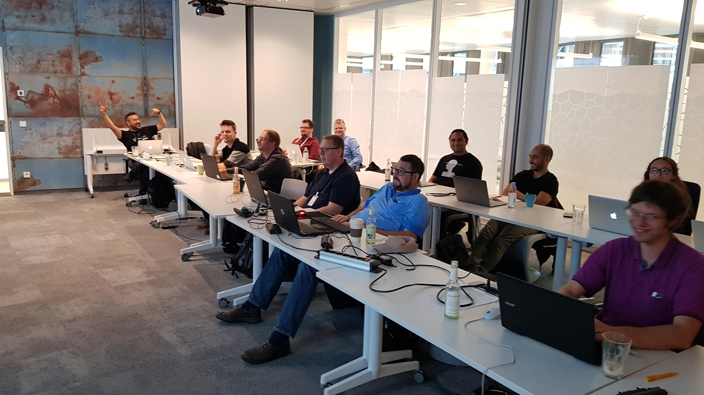

# 

[Altuğ Bilgin Altıntaş](https://www.linkedin.com/in/altuga/) is a Business Agility Engineer based on Istanbul/Turkey. He is the co-founder of [Kodcu](https://Kodcu.com), founder of [JUG Istanbul](https://jugistanbul.org/) and co-orgier of [Java Day Istanbul](https://www.javaday.istanbul/). He previously worked at Koç.net, Hakia, and Toyota Motor Europe at various technical leadership and coaching roles. He has been actively programming with Java since 1999. He is a active practitioner and coach in Kanban, Lean software development, GTD and Toyota Kata as problem solving approach.

He has already spoke at 40+ conferences (like JJUG Tokyo, JCON Germany, Lean Kanban France, Java Day Istanbul, and many others) organized 100+ meetups, 

## Personal Publications
* Writer of [Java ve Yazılım Tasarımı](http://www.papatya.gen.tr/java_ve_java_teknolojileri.htm) 
* Writer of [Kanban ile Çeviklik](https://leanpub.com/kanbanceviklik) 
* Social Media: [Twitter](https://twitter.com/altugaltintas), [Linkedin](https://www.linkedin.com/in/altuga)
* Written Content: [Medium](https://medium.com/@altuga) 

## Podcasts

* Podcast: [Agile Kanban Istanbul Podcast](https://anchor.fm/agile-kanban) 

<!--
#### Videos

-->

<!--
**altuga/altuga** is a ✨ _special_ ✨ repository because its `README.md` (this file) appears on your GitHub profile.

Here are some ideas to get you started:

- 🔭 I’m currently working on ...
- 🌱 I’m currently learning ...
- 👯 I’m looking to collaborate on ...
- 🤔 I’m looking for help with ...
- 💬 Ask me about ...
- 📫 How to reach me: ...
- 😄 Pronouns: ...
- ⚡ Fun fact: ...
-->
